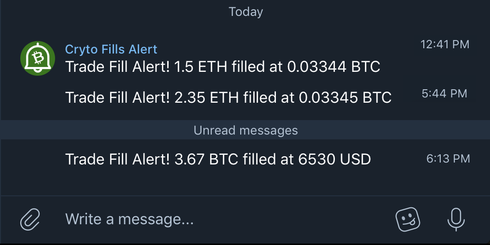

## Crypto Fills Alert Bot
No need to keep separate price alerts for your crypto trades 😎. I will alert you whenever your trade gets executed on CoinbasePro 🤑!

### Setup Demo
<iframe width="720" height="415" src="https://www.youtube.com/embed/URB3HmduDhA?mute=1" frameborder="0" allowfullscreen></iframe>

### PS - Only supports Coinbase Pro currently. More exchanges coming soon.

### Privacy 
(Last updated - 9/15/2018)

- We do not store any personally identifiable information. 
- We ask for "view" only API access. If you accidentaly give us API details with "trade" access, we will reject it.
- We do not and will not sell any information you give us to any third party.
- You can ask the bot to remove the API details and stop the alerts anytime.
- The bot will never suggest or recommend you to make any trades (No pump and dump ever)

### Support or Contact

You can contact me directly on telegram @hrdwrknvrstps

### Tip
<a class="tip-button" href="#">Tip with Metamask

