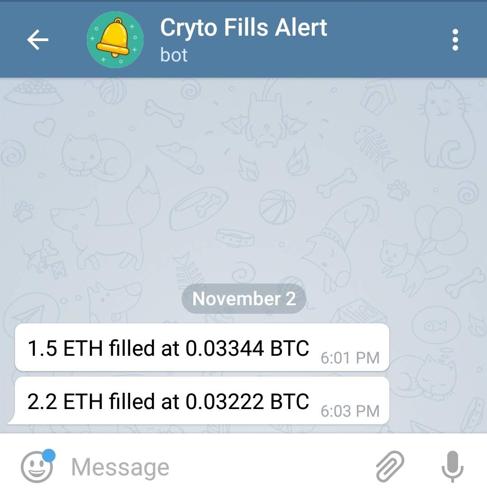

No need to keep price alerts for your crypto trades 😎. We will alert you whenever your trade gets executed on CoinbasePro 🤑!

**PS - THIS IS NOT A SIGNALS OR PUMP and DUMP BOT. WE WILL NEVER 🙅‍♂️ ADVERTISE, SPAM OR ADVICE YOU ON WHAT TO BUY OR SELL.**

## Setup Instructions and Demo
**We are only requesting view permissions. This does not give us access to your private keys nor the ability move your funds.**

This is just a one-time, 2 min setup procedure 🤓

To allow us to send you alerts on your CoinbasePro trades, you will need to generate and provide us with API key:
1. Start API input process using /coinbase_pro_api or the Add API button on the [@FillsAlertBot telegram bot](tg://resolve?domain=FillsAlertBot). The bot will wait for you to enter the passphrase
2. Open the Coinbase Pro [API Settings](https://pro.coinbase.com/profile/api) page
3. Click the + New API Key button
4. Copy the passphrase and pass it to the bot. It will wait for you to enter the API Secret
4. Under Permissions only select View
5. If applicable, enter your two-factor authentication code
6. Click Create API Key
7. Copy the API Secret shown on the dialog box and pass it to the bot. It will wait for API Key now
8. Copy the API Key after closing the dialog box and pass it to the bot. If everything works, you are done! 

### Setup Walkthrough Video

<iframe width="720" height="415" src="https://www.youtube.com/embed/URB3HmduDhA?mute=1" frameborder="0" allowfullscreen></iframe>

## Pricing

Simple, open, fair pricing

* Free 100 alerts per month. (Post that, you will receive payment instructions)
* 0.01 ETH per month for unlimited alerts (~$2)
* Earn additional 50 alerts per share via sharing options in the bot 

## PS - Only supports Coinbase Pro currently. More exchanges coming soon.

## Privacy 
(Last updated - 6/15/2019)

- We do not store any personally identifiable information. 
- We ask for "view" only API access. If you accidentaly give us API details with "trade" access, we will reject it.
- We do not and will not sell any information you give us to any third party.
- You can ask the bot to remove the API details and stop the alerts anytime.
- The bot will never suggest or recommend you to make any trades (No pump and dump ever)

## Support or Contact

You can contact me directly on telegram @hrdwrknvrstps or submit <a href="https://docs.google.com/forms/d/e/1FAIpQLScgSkJPefH4qzwJs0nQW-od-4oay5Sny0YCQDQIYhe4AircVA/viewform">this form</a> for any feedback or suggestions.
